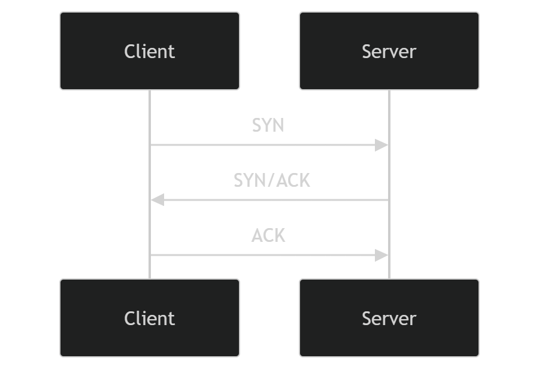

# Socket Programming and Networking Concepts

## 1. Sockets

- Sockets are an **abstraction provided by operating systems** to enable communication between different processes, either **on the same machine** or **over a network**.
- A **socket** is **one end-point of a two-way communication link** between two programs running on the network.
- Sockets allow programs to **send and receive data** over the network using **TCP or UDP protocols**.

---

## 2. TCP vs UDP

- **TCP (Transmission Control Protocol)**
  - Connection-oriented: establishes a reliable connection between two endpoints.
  - Reliable data transfer: guarantees delivery of all packets in order.
  - Uses a **three-way handshake** to establish a connection:
    1. SYN – client requests connection.
    2. SYN/ACK – server acknowledges and responds.
    3. ACK – client confirms connection established.
  - Suitable for applications like web browsing, file transfer, email.
  
- **UDP (User Datagram Protocol)**
  - Connectionless: no handshake, sends packets (datagrams) without establishing a connection.
  - Unreliable: no guarantee packets arrive or are in order.
  - Lower overhead, faster, ideal for real-time applications like streaming, gaming, or VoIP.



---

## 3. Endpoints

- An **endpoint** is uniquely identified by a combination of:
  - **IP address**  
  - **Port number**  
  - **Protocol (TCP/UDP)**

- **TCP connections** are identified by a **4-tuple**:
  - `(source IP, source port, destination IP, destination port)`
- This allows multiple clients to connect to the **same server port** simultaneously, each with a unique combination.

---

## 4. Port Numbers

- Each **socket is bound to a port number** to identify the application that data is sent to.
- Servers wait on a **listening socket** for incoming client connections.
- Clients connect using the **server hostname/IP and port**, and bind to a **local ephemeral port** automatically assigned by the OS if not specified.
- Each host has **65,536 ports** (0–65535).

### Port Ranges

| Range       | Description          | Typical Use                               |
|------------:|-------------------  |-----------------------------------------|
| 0–1023      | Well-known ports     | HTTP (80), FTP (21), SSH (22)           |
| 1024–49151  | Registered ports     | Applications/services that need specific ports |
| 49152–65535 | Ephemeral/dynamic    | Client-side connections, OS-assigned automatically |

### Common Well-Known Ports

| Port | Service |
|------|---------|
| 20, 21 | FTP |
| 23     | Telnet |
| 80     | HTTP |

---

## 5. Client-Server Model

- **Server**
  - Uses a **ServerSocket** (listening socket) to wait for incoming connections.
  - When a client connects, the server creates a **connection socket** for that client.
  - Can handle **multiple clients simultaneously** using separate connection sockets.
  
- **Client**
  - Uses a **Socket** object to connect to the server.
  - The OS assigns an **ephemeral port** for the client side.
  - Communication occurs over the **connected socket**.

---

## 6. Java Networking (`java.net` package)

- **Socket**
  - Implements the **client side** of a connection.
  - Example: `Socket socket = new Socket("serverIP", port);`
  
- **ServerSocket**
  - Implements the **server side** of a connection.
  - Example: 
    ```java
    ServerSocket server = new ServerSocket(5000);
    Socket client = server.accept(); // creates a connection socket
    ```

- Java sockets are **cross-platform**:
  - On **Windows**, they use **Winsock2** under the hood.
  - On **Linux/macOS**, they use **BSD sockets**.
  - Java communicates with the OS networking APIs via **JNI (Java Native Interface)**.

---

## 7. TCP Connection Lifecycle

1. **Listening** – Server waits for incoming connections on a specific port.
2. **Handshake** – TCP three-way handshake establishes a reliable connection.
3. **Data Transfer** – Client and server exchange messages over the connected socket.
4. **Termination** – Connection is closed gracefully, resources are released.

---

## 8. Summary

- Sockets provide an **abstraction for network communication**.
- TCP ensures **reliable communication**, UDP prioritizes **speed**.
- **Ports and endpoints** allow multiple applications to share the network interface.
- Java’s `Socket` and `ServerSocket` classes provide **easy-to-use APIs** for building network applications without worrying about OS-level details.

# Java Socket Example

## 1. Server Code

```java
import java.net.ServerSocket;
import java.net.Socket;
import java.io.OutputStream;

public class Server {
    public static void main(String[] args) {
        try {
            System.out.println("Server starting...");
            
            ServerSocket server = new ServerSocket(5000);
            System.out.println("Waiting for client...");
            
            Socket client = server.accept();
            System.out.println("Client connected...");
            
            OutputStream out = client.getOutputStream();
            String message = "Hello I am Jim from server";
            
            out.write(message.getBytes());
            
            System.out.println("Message sent");
        }
        catch (Exception e) {
            e.printStackTrace();
        }
    }
}
```
## 2. Client Code

```java
import java.net.InetAddress;
import java.net.Socket;
import java.io.InputStream;

public class Client {
    public static void main(String[] args) {
        try {
            System.out.println("Connecting to server...");
            
            // InetAddress addr = InetAddress.getByName("localhost");
            // Socket socket = new Socket("localhost", 5000, addr, 5041);
            
            Socket socket = new Socket("localhost", 5000);
            System.out.println("Connected to server!");
            
            InputStream in = socket.getInputStream();
            
            byte[] buffer = new byte[1024];
            
            int bytesRead = in.read(buffer);
            
            String message = new String(buffer, 0, bytesRead);
            
            System.out.println("Received: " + message);
            
        }
        catch (Exception e) {
            e.printStackTrace();
        }
    }
}
```
## Listen
```c
#include <stdio.h>
#include <string.h>
#include <winsock2.h>

int main() {
    WSADATA wsaData;
    SOCKET clientSocket;
    struct sockaddr_in serverAddr;
    char buffer[1024];
    int result;

    result = WSAStartup(MAKEWORD(2, 2), &wsaData);
    if (result != 0) {
        printf("WSAStartup failed\n");
        return 1;
    }

    clientSocket = socket(AF_INET, SOCK_STREAM, 0);
    if (clientSocket == INVALID_SOCKET) {
        printf("Socket creation failed!\n");
        WSACleanup();
        return 1;
    }

    serverAddr.sin_family = AF_INET;
    serverAddr.sin_port = htons(8080);
    serverAddr.sin_addr.s_addr = inet_addr("127.0.0.1");

    printf("Connecting to server...\n");

    if (connect(clientSocket, (struct sockaddr *)&serverAddr, sizeof(serverAddr)) == SOCKET_ERROR) {
        printf("Connect failed! Error: %d\n", WSAGetLastError());
        closesocket(clientSocket);
        WSACleanup();
        return 1;
    }

    printf("Conencted to server\n");

    const char *message = "Hello server! How are you?";
    send(clientSocket, message, strlen(message), 0);
    printf("Sent to server: %s\n", message);

    result = recv(clientSocket, buffer, sizeof(buffer) - 1, 0);
    if (result > 0) {
        buffer[result] = '\0';
        printf("Received from server: %s\n", buffer);
    }

    closesocket(clientSocket);
    WSACleanup();

    printf("\nPress Enter to exit client...\n");
    getchar();

    return 0;
}
```


